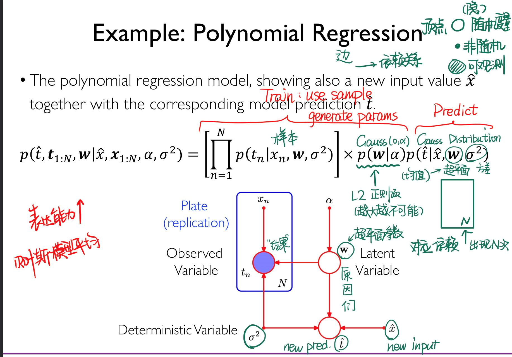

# Lecture 9: Reasoning (I)

!!!question
    We have several random variables.
    
    We can observe some of them(Temperature $P$, Date($D$)).

    We want to know the probability of others (Sunshine $S$, Rain $R$).

Modeling: assume that a joint distribution exists between variables:

$$
p(S,R,T,D)
$$

Inference: 

+ *condition* on some evidence ($T = 36.5 ^\circ \text C, D = 2021/07/31$)
+ interested in some other things ($p(R \mid T = 36.5 ^\circ \text C, D = 2021/07/31)$)

## Formally: Probabilistic Reasoning

We want to use random variable model to *learn*, to achieve the predict job.

+ $X = \{x_1, \cdots, x_D\}$ is a set of $D$ random variables.
+ query set $R$ and condition set $C$ are subsets of $X$

Modeling: How to specify a joint distribution $p(x_1, \cdots, x_D)$ compactly(紧凑地)[^1]?

[^1]: 我的理解是，计算的过程能尽可能的快和简单。

Inference: How to compute $p(R \mid C)$ effciently?

## Probabilistic Graphical Model

概率图模型。

We try to use graph to describe the correlation and dependence relationships between random varibales.

+ Vertex: Random variable
+ Edge: Their relationship

### Bayesian Network: DAG version

Bayesian Network:

+ a DAG graph
+ $p(x_1, \cdots, x_K) = \prod_{s=1}^{K} p(x_s \mid \bm x_{\Gamma(s)})$, $\Gamma(s)$ is the set of parents of $x_s$
    + as this graph is a DAG, there must be a order(topology order) that we can calculate from basic to the hole joint probability.

!!!example "Example: The Alarm Network"
    We can use our prior knowledge to reduce edges(finding independent variables).

!!!example "Example: in Medical"
    Use observable variables to infer hidden ones.

    Pro: Every conditional distribution of a random variable is *reasonable*.

    A totally white box!

!!!example "Example: Polynomial Regression" 
        

### Markov Random Field

undirected graph $G$

$$
p(\bm x) = \frac{1}{Z} \prod_C \psi_C(\bm x_C)
$$

+ $C$ is all (**maximal**) cliques in $G$
+ $\bm x = \{x_1, \cdots, x_n\}$
+ $\psi$ is a non-negative potential function defined on those cliques
    + usually $\psi_C(\bm x_C) = \exp\{-E(\bm x_c)\}$, $E$ is energy function.
    + low energy => high potential => high probability
+ $Z$ is a normalized factor

!!!example "Illustration: Image Denoising"

!!!note "Transformation method"
    Bayesian network can be transformed into Markov Random Field by

    + Linking the parents of each node;
    + remove directions.