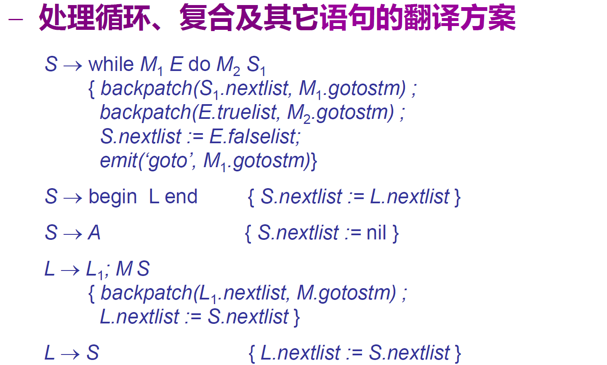
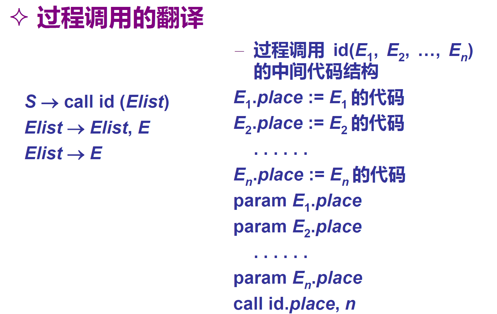

## 中间代码生成

### 中间代码

是源程序的一种内部表示形式

作用：

1. 避开源语言和目标语言之间的巨大跨度
2. 利用编译程序的重定向（不同的目标机器？）
3. 可以进行与目标机无关的优化

特点：

1. 有很多层次

实例：

1. AST
2. DAG
3. Postfix
4. TAC（三地址码，四元式）
5. P-code

#### 三地址码（TAC）或四元式

`x := y op z` ，或者 `(op y z x)`

### 具体语句的翻译

#### 声明语句

1. 建立符号表条目（包括：名字，类型，数据宽度，偏移地址）
2. 分配存储单元

#### 赋值语句

$S \rightarrow id := E$ 

语义属性：

+ id.lexeme：id 的名字
+ E.code：求取 E 的值的 TAC 语句（序列）
+ E.place：用于存放 E 的值的“名字”（“地方”）

生成：

`S.code := E.code || gen(top.get(id.lexeme) ':=' E.place) `

（如果 找不到 `id.lexeme` 就报错）

【可能需要类型转换】

#### 计算语句

$E \rightarrow E_1 + E_2$ 

生成：

`E.place := newtemp; E.code := E1.code || E2.code || gen(E.place := E1.place + E2.place)`

$E \rightarrow id$ 

生成：

`E.place := top.get(id.lexeme); E.code := ''`

#### 数组取值语句

内情向量（`dope vector`）：记录数组的一些信息【静态数组：存在可变表 】

数组寻址的计算

### 布尔表达式与控制语句

方法一：直接对布尔表达式求值

方法二：利用控制流实现，通过转移到程序某个位置来实现求值

目标 & 优点：实现短路 & 方便实现控制流语句中布尔表达式的翻译。

+ $E_1 \text{ or } E_2$ 翻译成 $\text{if } E_1 \text{then True else }  E_2$ 
+ $E_1 \text{ and } E_2$ 翻译成 $\text{if } E_1 \text{ then } E_2 \text{ else False } $ 

#### 布尔表达式

|                                      |                                                              |
| ------------------------------------ | ------------------------------------------------------------ |
| $E \rightarrow E_1 \text{ or } E_2$  | `E1.true := E.true; E1.false := newlabel;` `E2.true := E.true; E2.false := E.false;` `E.code := E1.code ||gen(E1.false, ':') ||E2.code;` |
| $E \rightarrow E_1 \text{ and } E_2$ | `E1.true := newlabel; E1.false := E.false;` `E2.true := E.true; E2.false := E.false;` `E.code := E1.code ||gen(E1.true, ':') ||E2.code;` |
| $E \rightarrow true$                 | `E.code := gen('goto', E.true)`                              |

#### 控制语句

|                                                              |                                                              |
| ------------------------------------------------------------ | ------------------------------------------------------------ |
| $S \rightarrow \text{if } E \text { then } S_1$              | `E.true = newlabel; E.false = S.next; S1.next = S.next;`  （这里的 `next` 是基本块，下面才讲） `S.code = E.code ||gen(E.true “:”) ||S1.code;` |
| $S \rightarrow \text{if } E \text{ then } S_1 \text{ else } S_2$ | `E.true := newlabel; E.false := newlabel;` `S1.next = S.next; S2.next = S.next;` `S.code := E.code ||gen(E.true ":") ||S1.code ||gen('goto' S.next) ||gen(E.false ":") ||S2.code` |
| while 语句                                                   |                                                              |
| switch 语句                                                  |                                                              |
| 过程调用                                                     |                                                              |

### 拉链与代码回填

解决需要多次遍历语法树的缺点；基于上述的控制流的布尔表达式实现

重要的一步：回填，就是把一系列代码空缺的“跳转”之类的调整至统一的位置

#### 语义属性——链

`E.truelist/falselist/nextlist` 表示控制流布尔表达式“真”“假”“下一个语句”跳转语句的地址（也就是要往里填跳转目标的位置）

语义过程：

`makelist` 新建一个链；`merge(p1,p2)` 合并两个链；

`backpatch(p,i)` 把  p 链中的每个位置都填上跳转目标 i

`nextstm` 下一条 TAC 语句的地址【其实是用来定位的？】

`emit(...)` 输出一条 TAC 语句，并使 `nextstm` +1

#### 布尔表达式的处理

|                                         |                                                              |
| --------------------------------------- | ------------------------------------------------------------ |
| $E \rightarrow E_1 \text{ or } M\ E_2$  | `backpatch(E1.falselist,M.gotostm) ;`  `E.truelist := merge(E1.truelist, E2.truelist) ;` ` E.falselist := E2.falselist ` |
| $E \rightarrow E_1 \text{ and } M\ E_2$ | `backpatch(E1 .truelist,M.gotostm);`  `E.falselist := merge(E1.falselist, E2.falselist) ;` `E.truelist := E2 .truelist;` |
| $E \rightarrow true$                    | `E.truelist := makelist (nextstm);`  `emit (‘goto _’)`  |
| $M \rightarrow \varepsilon$             | `M.gotostm := nextstm`                                       |

|                                                              |                                                              |
| ------------------------------------------------------------ | ------------------------------------------------------------ |
| $S → \text{if }E\text{ then }M\ S_1$                         | `backpatch(E.truelist,M.gotostm) ;` `S.nextlist := merge(E.falselist, S1.nextlist)` |
| $S \rightarrow \text{if }E\text{ then }M_1 \ S_1\ N\text{ else }M_2\ S_2$ | `backpatch(E.truelist, M1.gotostm);` `backpatch(E.falselist, M2.gotostm);` `S.nextlist := merge(S1.nextlist, merge(N.nextlist, S2.nextlist));` |
| $N \rightarrow \varepsilon$                                  | `N.nextlist := makelist(nextstm); emit(‘goto _’))`           |

|            |      |
| ---------- | ---- |
| while 循环 |      |
|            |      |
|            |      |

N 的意义是什么呢？跳转到 next 

### 过程调用的代码

## 代码生成与优化

KISS keep it simple and stupid

减少提前优化

### 需要考虑的问题

目标模块需要可以执行

目标模块需要可以被重新定位（被其他的程序调用、分模块的编译）

需要选择什么指令？（根据目标机的指令集）

寄存器如何分配？（需要尽可能高效）

指令按照什么顺序执行？（需要利用目标机器的特点）

### 基本块与流图

基本块：连续的语句序列，控制流能且仅能从它的开始进入，并且从他的末尾离开

流图：有向边表示基本块之间的控制流信息

#### 基本块划分算法

找到入口：

1. 序列的第一个语句是入口语句
2. 跳转语句的目标的语句是入口语句
3. 进跟在跳转语句的语句是入口语句

每一个入口语句到下一个入口语句之前的部分就是基本块

#### 流图的构建

$i \rightarrow j$ 成立，当且仅当

1.  程序 $j$ 在程序 $i$ 之后，且 $i$ 的最后一条语句不是无条件跳转（）或者停机语句；
2. $i$ 的出口是 $j$ 的入口语句

### 代码优化技术

#### 分类

按照优化范围：

1. 窥孔优化（peephole）：局部的，几条指令的
   1. 方法：来回滑动几条指令大小的窗口，发现不够优化的就优化
   2. 例：删除冗余的 load 和 store；合并已知量；常量传播；代数化简；控制流优化；死代码删除；强度削弱；使用目标机惯用指令。
2. 局部优化：基本块内的
   1.  合并已知量\删除多余运算\删除无用赋值
3. 全局优化：流图范围内的
   1. 全局公共表达式删除
   2. 全局死代码删除
4. 过程间优化：整个程序范围内的

按照优化对象：

1. 目标代码优化
2. 中间代码优化
3. 源级优化

按照优化侧面划分：

1. 指令调度
2. 寄存器分配
3. 存储层次优化
4. 循环优化
   1. 例：循环不变量外提
5. 控制流优化
6. 过程优化
