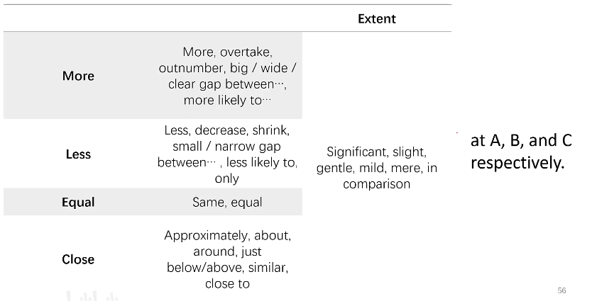
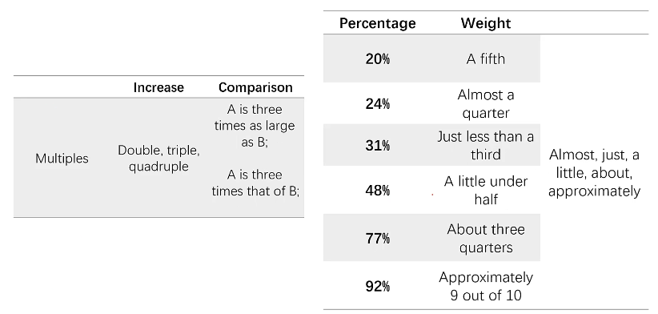

## General Limit

150 words in about 20 minutes
(More time probably need due to needing to add more information)

## Problem Types

Dynamic：比较**趋势**(Trends)。

Static：比较**数量**(Quantities)。

数据分析的方式与表达。

Map: Outdoor Map & Indoor Map

Flow Chart: 

## What is a good paper?

Like reporting to your manager or professor

+ Brief & Clear
+ Replicatable(可复原的)
+ WITHOUT PERSONAL OPINION

## General tips

+ Tense: whether it is in the past (2020?)

## Dynamic Charts

### Step1: Summary

!!!note inline end 
    + this ... demonstrates ...
    + (time) ... witnessed ...

1. Paraphrase the description.

2. Framework: Focus on the two axis, show numbers or quality.
    + From one side to another，similar or different between them？
    + similarity / differennce(grouping)

3. [Dynamic]General Trends: up or down?

4. [Static]What about your data group?

### Step2: Grouping & Step3 : Analysis

!!!note inline end
    + According to the graph, ...
    + it was a **different** story for ... 
    + Subsequently, ... 
    + the number peaked at ... by ...
    + going down a bit at ... by ...
    + among those who ...
    + In the mean time, ...
    + In contrast, ...
    + , accounting for the largest proportion.
    + unlike ..., ...
    + it experienced a  ....

1. major __commonalities__ : why grouping
2. What are the **key features** of each group?
    * [dynamic]Point: starting ,turning, ending, intersections, high & low
    * quantity: number
    * [static]internal difference/exception: lower or higher

总分结构：质 + 量

on one hand, ...; on the other hand, ...

### Step4: Interpretation

!!!note inline end
    + In conclusion, ...

Give reason.

Complete other general information.

升华一下: what stands behind these?

升华一下: 整体的想法

升华一下: 一张图的某个轴和另一张图的另一个轴

[Mixed charts] connection between charts.

## Static charts

Within data groups

Between data groups

### Expression

#### Words

#### Sentence Pattern

1. sub + verb + extent + change in data
2. ...[time] saw/witnessed a   ... change in ...
3. ... demonstrated / showed an ... trend, increasing/decreasing from ...  to ...
4. A ... change can be seen in ..., [data] 
5. There was  ... change in  ... , [data]

#### Connection:

+ before ...
+ and then ...
+ followed by ...