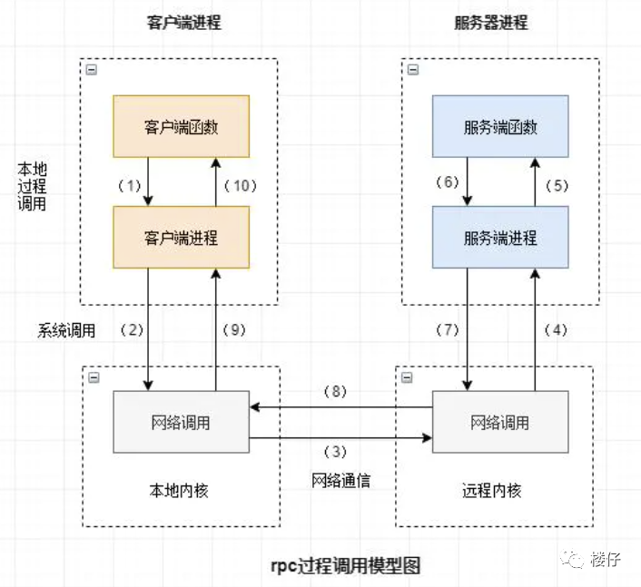
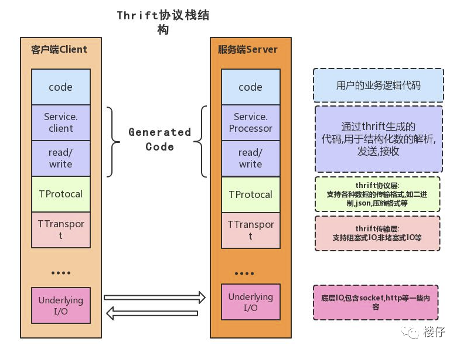

# Thrift

（数据库大作业的侧记）

## 什么是 Thrift？

首先要了解的概念是 **RPC** 。

> 可以阅读[这篇文章](https://mp.weixin.qq.com/s/ll4nUVB28KpyTMS93xAckQ)了解 RPC 服务。

> RPC（Remote Procedure Call Protocol）远程过程调用协议。一个通俗的描述是：**客户端在不知道调用细节的情况下，调用存在于远程计算机上的某个对象，就像调用本地应用程序中的对象一样。**
> 
> 比较正式的描述是：一种通过**网络**（或者本地的 Socket）从（远程/本地其他）计算机程序上请求服务，而不需要了解底层网络技术的协议。
> 
> 那么我们至少从这样的描述中挖掘出几个要点：
> 
> 1. RPC是协议：既然是协议就只是一套规范，那么就需要有人遵循这套规范来进行实现。目前典型的RPC实现包括：Dubbo、Thrift、GRPC、Hetty等。
> 
> 2. 网络协议和网络IO模型对其透明：既然RPC的客户端认为自己是在调用本地对象。那么传输层使用的是TCP/UDP还是HTTP协议，又或者是一些其他的网络协议它就不需要关心了。
> 
> 3. 信息格式对其透明：我们知道在本地应用程序中，对于某个对象的调用需要传递一些参数，并且会返回一个调用结果。至于被调用的对象内部是如何使用这些参数，并计算出处理结果的，调用方是不需要关心的。那么对于远程调用来说，这些参数会以某种信息格式传递给网络上的另外一台计算机，这个信息格式是怎样构成的，调用方是不需要关心的。
> 
> 4. 应该有跨语言能力：为什么这样说呢？因为调用方实际上也不清楚远程服务器的应用程序是使用什么语言运行的。那么对于调用方来说，无论服务器方使用的是什么语言，本次调用都应该成功，并且返回值也应该按照调用方程序语言所能理解的形式进行描述。
> 
> 
> 
> 图片来源同上。

上面提到，Thrift 是 RPC 的一种实现。那么 Thrift 具体实现了什么呢？来看一段简介。

> Thrift 是一种可伸缩的跨语言服务的RPC软件框架。它结合了功能强大的软件堆栈的代码生成引擎，以建设服务，高效、无缝地在多种语言间结合使用。2007年由 Facebook 贡献到 Apache 基金，是 Apache 下的顶级项目，具备如下特点：
> 
> + 支持多语言：C、C++ 、C# 、D 、Delphi 、Erlang 、Go 、Haxe 、Haskell 、Java 、JavaScript、node.js 、OCaml 、Perl 、PHP 、Python 、Ruby 、SmallTalk
> + 消息定义文件支持注释，数据结构与传输表现的分离，支持多种消息格式
> + 包含完整的客户端/服务端堆栈，可快速实现RPC，支持同步和异步通信
>
> 

> Transport 层：代表 Thrift 的**数据传输方式**， Thrift 定义了如下几种常用数据传输方式：
> 
> + TSocket: 阻塞式socket；
> + TFramedTransport: 以frame为单位进行传输，非阻塞式服务中使用；
> + TFileTransport: 以文件形式进行传输。
> 
> TProtocol 层：代表 Thrift 客户端和服务端之间**传输数据的协议**，通俗来讲就是客户端和服务端之间传输数据的格式(例如json等)，thrift定义了如下几种常见的格式：
> 
> + TBinaryProtocol: 二进制格式；
> + TCompactProtocol: 压缩格式；
> + TJSONProtocol: JSON格式；
> + TSimpleJSONProtocol: 提供只写的JSON协议。
> 
> Server 模型：指定 Server 端采用的**模型**
> 
> + TSimpleServer: 简单的单线程服务模型，常用于测试；
> + TThreadPoolServer: 多线程服务模型，使用标准的阻塞式IO；
> + TNonBlockingServer: 多线程服务模型，使用非阻塞式IO(需要使用TFramedTransport数据传输方式);
> + THsHaServer: THsHa引入了线程池去处理，其模型读写任务放到线程池去处理，Half-sync/Half-async处理模式，Half-async是在处理IO事件上(accept/read/write io)，Half-sync用于handler对rpc的同步处理；

简单来说，我的理解就是：

> 一个 Server - Client 模型程序的实现方法。